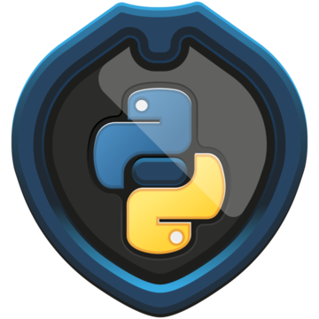

# 🐍 30 Days Of Python 

|# Day | Topics                                                    |
|------|:---------------------------------------------------------:|
| 01  |  [Introduction](./readme.md)|

  <h1> 30 Days Of Python: Day 1 - Introduction</h1>
  
  

  Author:
  <a href="https://www.linkedin.com/in/luizfpavanello/" target="_blank">Fernando Vicentin Pavanello</a> 
  <small> First Edition: March, 2022</small>
  

- [🐍 30 Days Of Python](#-30-days-of-python)
- [📘 Day 1](#-day-1)
  - [Welcome](#welcome)
  - [Introduction](#introduction)
  - [Why Python ?](#why-python-)

  # 📘 Day 1

## Welcome

**Congratulations** for deciding to participate in a _30 days of Python_ programming challenge . In this challenge you will learn everything you need to be a python programmer and the whole concept of programming. In the end of the challenge you will get a _30DaysOfPython_ programming challenge certificate.

## Introduction

Python is a high-level programming language for general-purpose programming. It is an open source, interpreted, objected-oriented programming language. Python was created by a Dutch programmer, Guido van Rossum. The name of Python programming language was derived from a British sketch comedy series, *Month Python's Flying Circus*.  The first version was released on February 20, 1991. This 30 days of Python challenge will help you learn the latest version of Python, Python 3 step by step. The topics are broken down into 30 days, where each day contains several topics with easy-to-understand explanations, real-world examples, many hands on exercises and projects.

This challenge is designed for beginners and professionals who want to learn python programming language. It may take 30 to 100 days to complete the challenge, people who actively participate on the telegram group have a high probability of completing the challenge.
If you are a visual learner or in favor of videos, you may get started with this [Python for Absolute Beginners video](https://www.youtube.com/watch?v=11OYpBrhdyM).

## Why Python ?

It is a programming language which is very close to human language and because of that it is easy to learn and use.
Python is used by various industries and companies (including Google). It has been used to develop web applications, desktop applications, system adminstration, and machine learning libraries. Python is highly embraced language in the data science and machine learning community. I hope this is enough to convince you to start learning Python. Python is eating the world and you are killing it before it eats you.